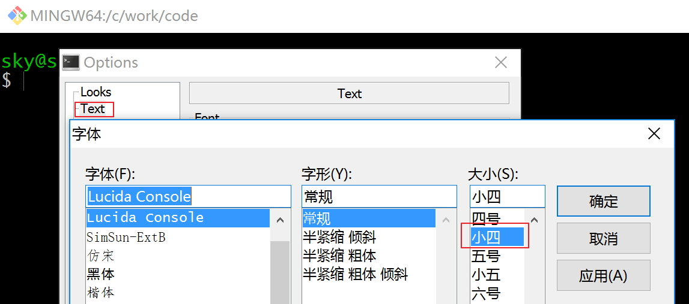

## 下载

在 [git官网](https://git-scm.com/)的下载页面找到windows版本

https://git-scm.com/download/win

下载得到安装包，如 ·Git-2.11.0.3-64-bit.exe·

## 安装

安装过程基本按照默认设置，一路next就好了。

不过个人不喜欢引入太多的东西进入操作系统，所以个别设置会进行修改。

默认 "Git Bash Here" 和 "Git GUI Here" 是勾选的，我一般去掉。

默认是第二个，我一般选第一个，只在git bash里面用git。

务必选第一个。

terminal 建议还是用MinTTY，window的 cmd 实在不好用。

## 配置

### 修改启动后的默认路径

安装完成之后，桌面的 Git Bash 快捷方式打开之后，默认进入当前用户的home目录。

如果需要修改，比如我个人习惯直接进入代码存放路径如 `C:\work\code`，则需要修改快捷方式的属性。

编辑快捷方式的属性：

目标中删除 `--cd-to-home`， 然后将起始位置从默认的 `%HOMEDRIVE%%HOMEPATH%` 修改为 `C:\work\code`。

### 修改控制台字体

Git Bash 控制台默认的字体如果不合适（通常字体偏小），可以修改。

1. 点下图中红色箭头处，下拉菜单中选择"Options"

	

2. 在 "Text" 中可以选择字体和大小

	
