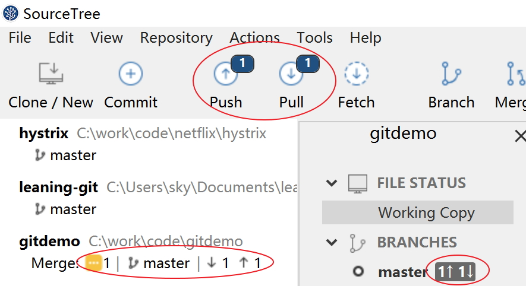
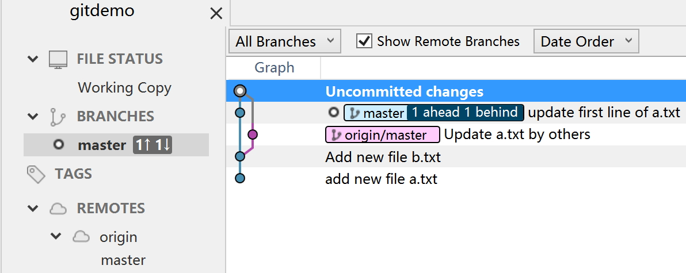

# Pull 时冲突

## 背景

对于 pull 操作，一种常见的可能就是 pull 下来时发现远程仓库的代码和自己的本地的代码冲突了。

这种事情通常发现在自己修改代码提交并push到远程时，时间线一般是这样：

- A pull 最新代码
- A 开始修改
- B pull 最新代码
- B 开始修改
- B 提交并 push 到远程仓库，成功
- A 完成修改，本地提交，然后试图 push 到远程时失败，因为远程已经有修改，不能 fast forward
- A 不得不先进行 pull 操作
- A/B 修改了同一个内容，造成冲突

## 模拟操作

我们模拟同时修改 a.txt 文件的场景，假设有其他人修改了该文件的第一行然后提交并push到远程仓库：

```bash
aaaaaaaaaa10 - changed by others
```

但是我们不知情，继续在本地修改 a.txt 文件，也是修改第一行：

```bash
aaaaaaaaaa10 - changed by myself
```

随即commit并push, 报错如下：


push 操作被拒绝，"Updates were rejected because the remote contains work that you do not have locally", 提示 "You may want to first integrate the remote changes (e.g., 'git pull ...') before pushing again."

## pull 时 merge 冲突

此时只能 pull 了，pull 时 git 会进行一个自动 merge，这里因为我们故意修改了同一行内容，因此必然发生冲突，提示：



点下方的 "File Status" 可以看到详细的文件合并情况：


在这里可以看到，a.txt 的自动合并失败，此时 a.txt 文件的内容会变成这个样子：

```bash
<<<<<<< HEAD
aaaaaaaaaa10 - changed by myself
=======
aaaaaaaaaa10 - changed by others
>>>>>>> c3b37ec3419529c0fe7c37e524caf68f45a1da83
aaaaaaaaaa20
aaaaaaaaaa30
aaaaaaaaaa40
aaaaaaaaaa50
```

这里的规则：

1. "=======" 是分隔符
2. "<<<<<<< HEAD" 和 分隔符 之间的内容是自己本地打算提交的内容
3. 分隔符 和 ">>>>>>> SHA" 之间的内容是远程已经提交的内容，可以通过这次提交的SHA找到具体的提交信息

我们现在需要做的事情，是决定此处的冲突应该如何解决，即最后这行的内容应该是什么？

通常来说，选择有三种：

1. 覆盖远程的修改，维持自己的内容

	

	如图所示，在文件上右键，选择"Resolve Conflicts" -> "Resolve Using Mine", 弹出提示：

	

	确认即可，此时看到的本地文件状态如图，由于放弃了远程修改维持本地提交的内容，因此表现为本地文件没有修改，再 push 就可以了。

    

2. 放弃自己的内容，维持远程的修改

	类似的选择"Resolve Conflicts" -> "Resolve Using Theirs". 完成后的情况小有不同，本地文件内容已经被修改（被远程修改覆盖），需要再次commit然后push。

    

3. 根据自己的内容和远程的内容，给出一个和两者都不一样的内容，通常是包含两者的改动

	最简单的方式就是自己直接打开文件，修改内容为自己需要的，比如：

	```bash
    aaaaaaaaaa10 - changed by myself and others
    aaaaaaaaaa20
    aaaaaaaaaa30
    aaaaaaaaaa40
    aaaaaaaaaa50
    ```

	> 记得务必将三行标识符号删除

对于文件简单而冲突情况非常清晰的场景，这种方案可以简单的解决问题，但是当文件内容比较多，冲突情况复杂而不明朗时，尤其是有多个冲突，每个冲突点的取舍各不相同，需要逐个排查时，就需要有更好的方案了。

