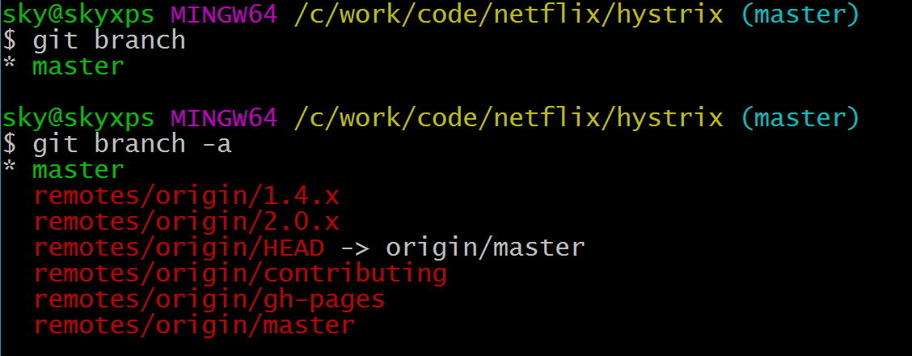
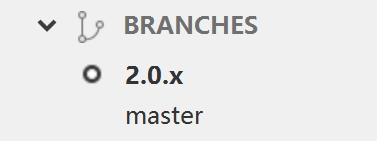
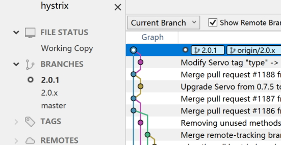
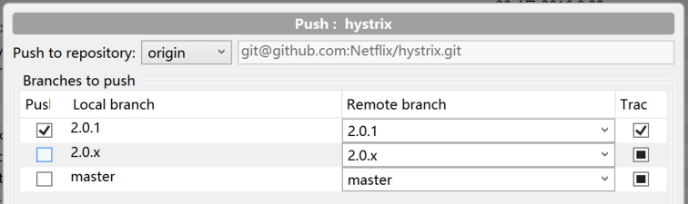

# 分支 / branch

## 查看分支

这里可以看到当前仓库的分支情况：

- 红色箭头处是当前所在的本地分支
- 红圈内是远程仓库的所有分支

可以对比一下命令行下的情况，`git branch` 命令是显示本地分支，前面带"*"的是当前分支，`git branch -a` 是显示包含本地分支和远程分支的所有分支：

## checkout 分支

在 REMOTES 远程分支这里，找到要checkout 的分支，右键，点击"checkout origin/###"

checkout 成功之后，当前本地的分支会切换到你新checkout的分支上：

注意此时本地就两个分支，前面带圈的是当前所在的分支。

同样可以对比一下命令行下的情况：

## 创建新分支

点击工具栏中的 "Branch" 按钮，

或者菜单中的 "Repository" -> "Branch...", 输入新分支的名字：

这表示从当前本地分支所在的最后一个commit开始拉出一个新的branch(当然也可以选择"Specified commit"然后选择某个特定的commit)，"Checkout New Branch"勾选表示新分支创建成功之后就直接checkout到这个新建的分支。

点"Create Branch"，成功之后，就已经转到新的branch上去了：

新创建的 branch 目前只存在于本地，需要 push 到远程仓库，在该branch上右键，选择"Push to" -> "origin"：

点"Push"就可以push到远程仓库。

## 删除分支

在本地分支上右键，选择"Delete ###" 即可删除该分区。

> 注意在删除该分支前，先checkout到其他分支，否则会删除失败。

这个方式甚至可以直接操作远程分支，直接删除远程仓库中的分支，不过建议谨慎使用。
