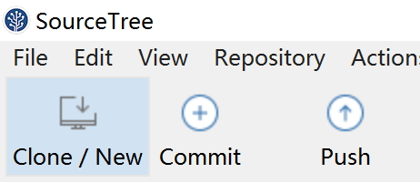
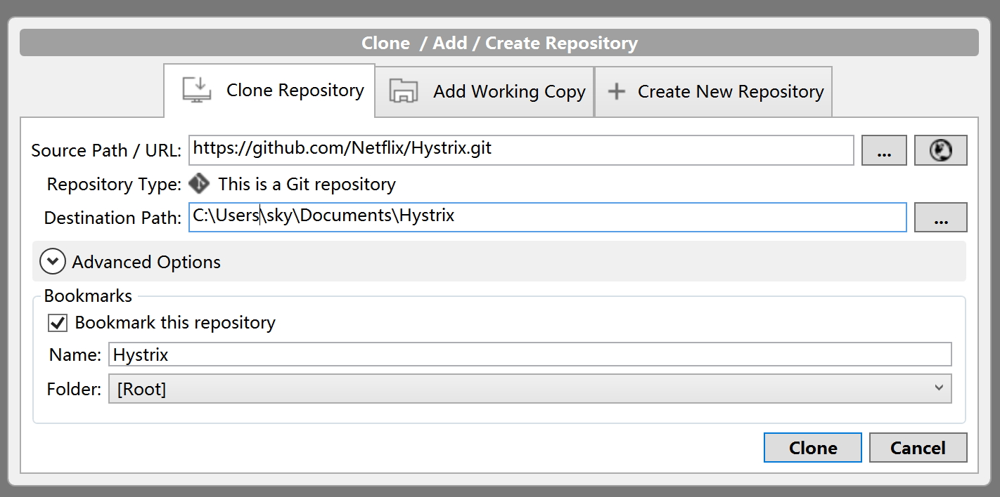
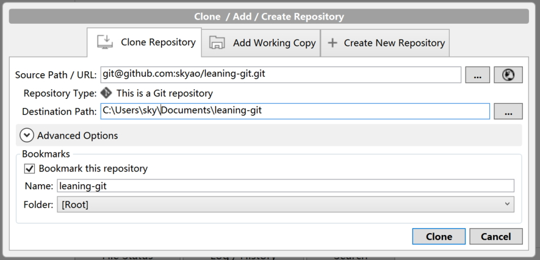
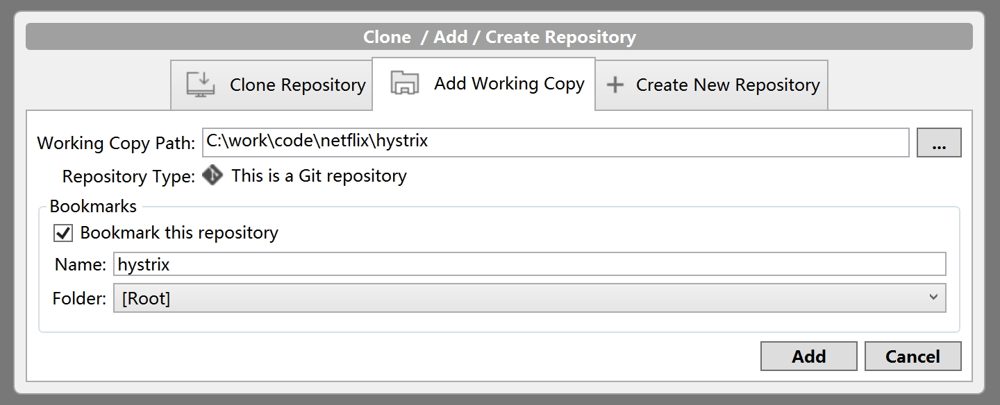
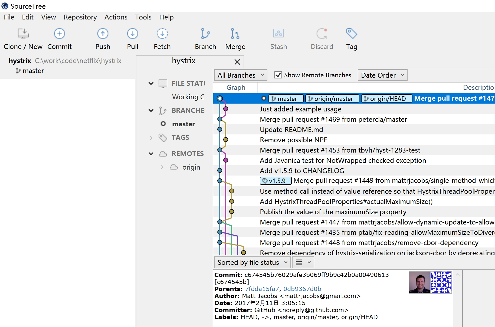

# 仓库

在打开的 SourceTree 中点左上角的"克隆/新建"：

## 克隆

选择"clone repository",这个选项是从远程仓库克隆一份到本地：

### 使用 HTTPS 克隆

克隆成功之后的提示：

### 使用 SSH 克隆

如果设置好了SSH客户端，就可以用ssh克隆的方式：

## 添加工作副本

选择"add working copy",这个选项是本地已经有一份克隆好的仓库，现在只是让 sourcetree 打开这个已经克隆好的仓库：

以下为打开的仓库视图：

