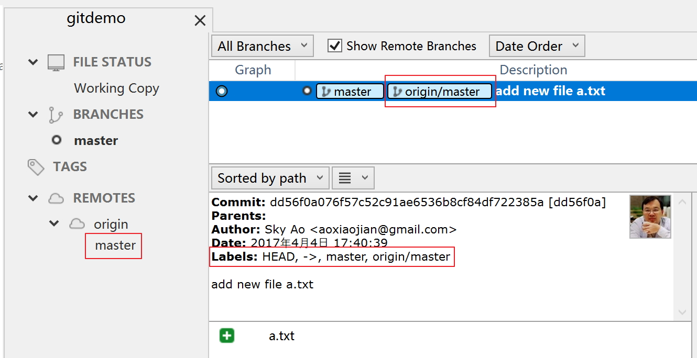
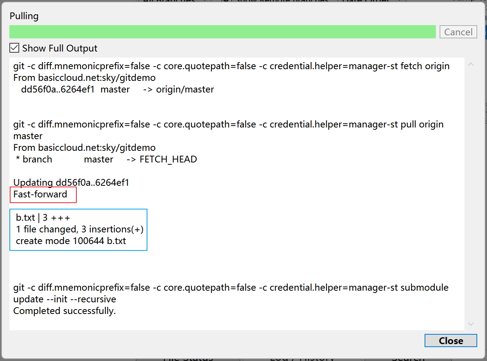

# 基本操作

介绍在 sourcetree 下进行git的几个基本操作的方式，顺便熟悉一下 sourcetree 的界面。

> 背景：我们建立了一个名为 gitdemo 的空仓库，从零开始，展示日常开发中的基本操作。

### 克隆仓库


此时在 sourcetree 中看到的是一个空的仓库，没有任何文件。


### 新增文件

在本地根目录下新建文件 a.txt, 内容如下：

```bash
aaaaaaaaaa10
aaaaaaaaaa20
aaaaaaaaaa30
aaaaaaaaaa40
aaaaaaaaaa50
```

在 sourcetree 中看到的是：


- "Staged files": 已经修改并stage的文件
- "Unstaged files": 列出的是当前仓库中未被 git 跟踪或者有修改而没有stage的文件，点击每个文件可以在右边看到内容

点击右边的 "Stage Hunk" 按钮可以将当前选中的文件加入到 "Staged files" (或者用"Stage All" / "Stage Selected" 按钮):


> 注: 等同于命令行下的 "git add a.txt" 命令

如果发现有错误添加文件，可以在 "Staged files" 中选中该文件，然后选"Unstage Selected"， 或者右边的 "Unstage hunk"按钮。

同样在点击 "Staged files" 列表中的每个文件时，右边会出现当前这个文件的修改情况。在这里可以非常方便的看到当前已有的文件修改有哪些内容。

### 提交修改

文件修改完成，就可以提交了，在下方输入当前提交的comments，点击 "Commit" 就可以将 "Staged files" 列表中的所有修改提交：


> 注: 等同于命令行下的 `git commit -m  "your comments" 命令

提交完成后，可以看到本次提交的详细情况：


**最佳实践：**

- 每次提交之前，尽量逐个检查 "Stage files" 列表中的每个文件，确保每个文件都是你真的准备提交的，避免因为错误操作提交了不应该提交的文件
- 每次提交之前，尽量逐个检查 "Stage files" 列表中的每个文件，检查每个文件的修改内容是否OK，避免低级失误，比如不小心改动了文件却忘了改回来
- 每次提交的comment内容，务必能准确的描述了这次提交干了什么，以便未来方便浏览

### push/推送

提交完成之后，开始推送到远程仓库, 点击工具栏中的 "Push" 按钮(或者"Repository" -> "Push"):


提交完成的情况：


仔细对比 Push 前后这个提交的详细情况：

- push 后：注意三个红色框的内容

	

- push 前

	

### pull

> 注：为了演示pull，我们在gitlab的web界面上做了一个增加新文件的操作，增加了文件 b.txt

点击工具栏中的 "Pull" 按钮(或者"Repository" -> "Pull"):


为了看到 Pull 的详细情况，我们勾选了"Show Full Output":



在没有冲突的情况下，pull操作很简单的完成了，远程仓库的新的提交被pull下来，体现在 sourcetree 中就是提交列表中增加了一个新pull下来的提交。然后本地分支的内容得以更新，体现为本地文件中增加了一个 b.txt 文件：


