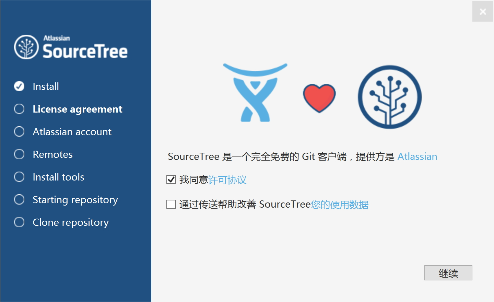
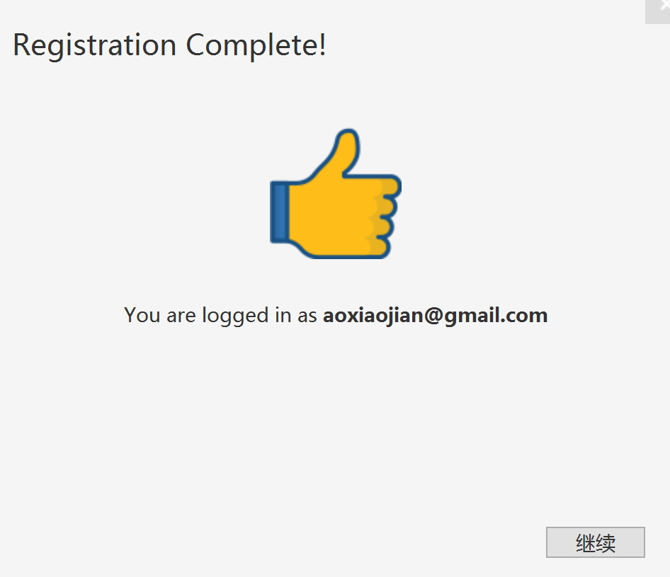

# 安装

## 下载

在 sourcetree 网站下载对应的版本(windows或者mac)

https://www.sourcetreeapp.com/

## 安装

打开下载的文件如 SourceTreeSetup-1.10.23.1.exe 开始安装.

步骤1：统一协议

步骤2：使用 Atlassian 账号登录

要求必须使用 Atlassian 账号登录才能继续，如果有账号的可以点"Use an existing account" 直接登录，如果没有账号可以点"Go to My Atlassian"去注册，完成后再回来登录。

特别提醒：Atlassian 的网站采用了一种名为"人机身份验证"的程序来保护自己，避免被攻击。这个程序采用的是 Google ReCAPTCHA ，因此对于大陆的同学可能因为被墙而无法使用，报错如下：

翻墙之后就OK了，如图所示：

继续，点"Use an existing account" 开始登录，弹出窗口：

输入账号密码，登录成功后跳转到下面的窗口，就可以继续了：

特别注意：如果是注册很多年的账号，会出现一个很奇怪的问题，输入账号密码登录之后，会停留在这个界面而不进行跳转，导致无法继续安装。经过检查是因为我这个账号很多年前就注册使用过，里面的 sourcetree 服务已经过期（2013年就过期）。

新账号不会有这个问题，所以我被逼重新注册了另外一个新账号。

步骤3：创建账号

如果不需要使用 BitBucket，可以点"跳过初始设置".

步骤4：加载SSH密钥

如果有现成的，可以载入，没有就先跳过。

步骤5：设置git

点"选择你的系统中git的位置"，然后选中你git安装路径中的git.exe,一般是 ·yourGit\bin\git.exe·

步骤6：设置Mercurial

点"我不想使用Mercurial"，跳过。
